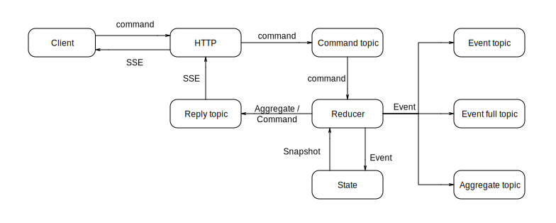

# JSON Event Sourcing

- [Introduction](#introduction)
- [Domain Driven Design](#domain-driven-design)
- [Command Query Responsibility Segregation](#command-query-responsibility-segregation)
- [This Library](#this-library)
- [Aggregates](#aggregates)
- [Commands](#commands)
- [Events](#events)
- [The Anatomy of an Application](#the-anatomy-of-an-application)
- [Uniqueness](#uniqueness)
- [The Kafka Topics](#the-kafka-topics)
- [Testing](#testing)
- [Configuration](#configuration)
- [The HTTP API](#the-http-api)
- [Access Control](#access-control)
- [Logging](#logging)
- [Server-Sent Events](#server-sent-events)
- [Auditing](#auditing)
- [Serialisation](#serialisation)
- [Reacting to Change](#reacting-to-change)
- [Validation](#validation)
- [Using JSLT](#using-jslt)
- [Troubleshooting](#troubleshooting)
- [API Documentation](#api-documentation)
- [The Artifact](#the-artifact)
- [The Maven Archetype](#the-maven-archetype)

## Introduction

[Event Sourcing](https://martinfowler.com/eaaDev/EventSourcing.html) is a scalable technique to manage the state of an application. Instead of using a central database that is kept consistent at all times, state is managed as a sequence of changes, which are appended to an event log. In other words, instead of managing the present you manage the past, i.e. everything that happened is recorded.

An action of a user can cause many things to change at the same time. When you're managing only the present you have no time-line. Therefore, all those changes have to succeed or fail together. Otherwise it would lead to inconsistencies. Transactions are the obvious way to implement this. With a central database this is very easy to do, but when several resources are involved you will need distributed transactions. These are very expensive and they don't scale well. The reason it that they require co-ordination and that they are synchronous by nature. As a consequence, all involved compute resources have to wait until some point when the transaction is finished. They usually also lock data in the process.

An alternative approach is to look at a user action as a trigger that sets in motion a chain of events. The business logic can be spread over a number of microservices that each focus on a particular task. The user action arrives at some point and may lead to a change there. This change is then recorded as an event and is also published. Other microservices can pick this up and react accordingly. This may lead to yet other changes, which are propagated and reacted upon. etc.

If each step in the chain is reliable all involved resources will eventually be consistent. This is not to be confused with referential consistency in a database, because each microservice is completely isolated. It just implements rules like "if this happens, then that should happen". The outcome of all those rules will, together, reflect a consistent state as a reaction to an external event.

This is what event-driven design is about. Everything that happens is a reaction to something else that has happened. The components of an application only manage and propagate change. In fact, the term application becomes looser. It is more like a viewpoint from where to look at the entire collection of microservices. Some ad hoc combination of microservices can be looked at as an application. There will be several of such "applications" and they may pop up in many ways. What the user sees as one big application is merely an assembly of small applications. This mix will probably depend on the context and the device that is being used.

## Domain Driven Design

[DDD](https://dddcommunity.org) provides us with the more formal underpinnings of an event-driven microservices design. In DDD an application is a collection of isolated domains. The domain is where all business logic is implemented. If the domain needs state, then this state is completely private. It is an aggregation of entities, which you can only access through its aggregate root.

This simple fact enables the horizontal scaling of components. Since each aggregate instance owns its data and since nothing else can access it, the instance could run anywhere in the world. Of course, there usually is some database system behind it and many aggregate instances will keep their data in the same system. However, when more throughput is needed the instances can easily be moved to other systems.

DDD doesn't say how the state of a domain should look like, but clearly an event log is a good candidate. We don't need a structure that allows efficient querying. We don't need to "join" the data with other data. We only need to record everything that changes and be able to easily resurrect an aggregate instance from the history of changes. As a consequence, Event Sourcing is a natural fit for DDD.

Another essential aspect of DDD is the "ubiquitous language". It defines a vocabulary for a software project, which should be used from the business specification down to the implementation. In order to achieve this all stake holders must communicate regularly. There should be no mapping of a concept at one level to different concepts at another. This solves the communication problem.

We can view an aggregate as a receiver of commands, which are expressed in the ubiquitous language and which may cause an effect. The effect is recorded as an event and published, so others can react to it.

## Command Query Responsibility Segregation

[CQRS](https://martinfowler.com/bliki/CQRS.html) is a technique that let's us always use the right tool for the job. In the central database approach there is only one copy of the data and only one model to describe it. All updates and queries happen against the same database. Because a central database is supposed to manage the present consistently, its model is usually optimised for updates. After all, protecting the integrity of the data comes first. This is rarely ideal for queries. Moreover, there may be many ways we would like to query the data.

With CQRS we can use several models of the data. Each model can be fully specialised in the kind of queries it proposes. For example, the write-model could be an event log, which is very efficient is appending records. Because all changes are published several read-models can be derived, e.g. a structured query model, a full-text model, a graph-model, etc. Those models can transform the data in any way they want, so long as it is derived from the single source of truth, which is the event log.

## This Library

The package published here is an opinionated library that implements the above concepts for the [JSON](https://tools.ietf.org/html/rfc8259) format, which is used in so many tools. It requires [Apache Kafka](https://kafka.apache.org) for messaging and [MongoDB](https://www.mongodb.com) for storing state.

An aggregate is a microservice with an interface that is composed of only Kafka topics. It receives the commands on a command topic. It emits events on two event topics, one which describes only the changes and another which also has the previous and the new state of the aggregate instance. The new state is also published separately on an aggregate topic. Finally, there is a reply topic to which either the new aggregate state is sent or the original command, annotated with errors.

The reply topic is meant for providing asynchronous feedback to the client. Clients can react to the messages on the reply topic, for example through [Server-Sent Events](https://www.w3.org/TR/eventsource/). This combines the client and the server in one reactive loop, where data travels in only one direction.

Inside the aggregate there is a reducer, which is provided by the application developer. A reducer is a function that receives the current state of an aggregate instance and a command. Its task is to verify the command and to calculate the new state of the aggregate instance. The result is either the new state or the annotated command in case something was wrong with it.

For any particular aggregate instance all commands are processed sequentially. The commands will be consumed in the order they arrived.



## Aggregates

An aggregate is a JSON document, which can have any structure plus the following technical fields:

|Field|Description|Mandatory|
|-----|-----------|---------|
|\_corr|The correlation identifier that was used by the last command. It is usually a UUID.|Yes|
|\_deleted|This boolean marks the aggregate instance as deleted. This is a logical delete.|No|
|\_id|The identifier of the aggregate instance. It is usually a UUID.|Yes|
|\_jwt|The decoded JSON Web Token that was used by the last command.|No|
|\_seq|A sequence number. This is the sequence number of the last event.|Yes|
|\_type|The aggregate type, which is composed as ```<application>-<name>```.|Yes|
 
## Commands

A command is a JSON document, which has the following technical fields on top of whatever you put in it:

|Field|Description|Mandatory|
|-----|-----------|---------|
|\_command|The name of the command.|Yes|
|\_corr|A correlation identifier. It is propagated throughout the flow. This is usually a UUID.|Yes|
|\_error|This boolean indicates there is a problem with the command. It is set by a reducer.|No|
|\_id|The identifier of the aggregate instance. It is usually a UUID.|Yes|
|\_jwt|The decoded JSON Web Token.|No|
|\_languages|An array of language tags in the order of preference. When a validator or some other component wishes to send messages to the user, it can use the proper language for it.|No|
|\_type|The aggregate type, which is composed as ```<application>-<name>```.|Yes|

## Events

An event is a JSON document. It is generated by the library, which compares the old state of the aggregate instance with the new state produced by the reducer. An event has the following technical fields:

|Field|Description|
|-----|-----------|
|\_after|An optional field that carries the new state of the aggregate instance.|
|\_before|An optional field that carries the previous state of the aggregate instance.|
|\_command|The name of the command that caused the event to be created.|
|\_corr|The correlation identifier that was used by the last command. It is usually a UUID.|
|\_id|The identifier of the aggregate instance. It is usually a UUID.|
|\_jwt|The decoded JSON Web Token that was used by the last command.|
|\_ops|An array of operations as described in RFC 6902. It describes how an aggregate instance has changed after the reduction of a command.|
|\_seq|A sequence number. There should not be holes in the sequence. This would indicate corruption of the event log.|
|\_timestamp|The timestamp in epoch millis.|
|\_type|The aggregate type, which is composed as ```<application>-<name>```.|

## The Anatomy of an Application

Let's discuss the example in the code snippet below. An aggregate is implemented with [Kafka Streams](https://kafka.apache.org/documentation/streams/). You always create a streams topology first and then start it. That is why on line 77 a ```StreamsBuilder``` is created. That builder is passed to the ```Aggregate``` class, because it's ```build``` method also creates a structure of streams. It is called on line 51.

On line 73 the default configuration is loaded from ```conf/application.conf```. Configuration will be discussed in separate section below.

The ```environment``` on line 40 is used to make a distinction between, for example, production, testing or development environments. That is because resources for those environments may be created in the same cluster. The aggregate appends the environment to all Kafka topic names and MongoDB collections.

On lines 49 and 50 two reducers are registered. They take a command and the current state of the aggregate instance and produce the new state. The signature of a reducer is always the following:

```
CompletionStage<JsonObject> reducer(JsonObject command, JsonObject currentState);
```

This uses the [Java JSON API](https://www.javadoc.io/doc/javax.json/javax.json-api/latest/overview-summary.html). A reducer returns a [```CompletionStage```](https://docs.oracle.com/javase/8/docs/api/java/util/concurrent/CompletionStage.html), because it may access other resources and this should happen in a non-blocking way. If your reducer doesn't need external resources you can just wrap the result with the [```completedFuture```](https://docs.oracle.com/javase/8/docs/api/java/util/concurrent/CompletableFuture.html#completedFuture-U-) method.

Instead of registering one reducer per command you can also register one reducer for everything and dispatch the commands internally.

Line 52 says that all log messages should go to a log Kafka topic. The messages are in the [Elastic Common Schema](https://www.elastic.co/guide/en/ecs/current/index.html) format. For aggregates all commands and events are logged. Commands that are in error are logged as well.

Finally, the topology is built on line 77 and started on line 79. It will run with "at least once" Kafka semantics. The default serialiser for keys is the string serialiser. For values it uses the [JSON serialiser](https://www.javadoc.io/doc/net.pincette/pincette-jes-util/latest/index.html). As a consequence, all streams are declared as ```KStream<String, JsonObject>```.

This example is available in the repository [pincette-plusminus](https://github.com/json-event-sourcing/pincette-plusminus).

```
      1	package net.pincette.plusminus;
      	
     2	import static com.mongodb.reactivestreams.client.MongoClients.create;
     3	import static java.lang.System.exit;
     4	import static java.util.concurrent.CompletableFuture.completedFuture;
     5	import static java.util.logging.Level.parse;
     6	import static java.util.logging.Logger.getLogger;
     7	import static javax.json.Json.createObjectBuilder;
     8	import static net.pincette.jes.elastic.Logging.logKafka;
     9	import static net.pincette.jes.util.Configuration.loadDefault;
    10	import static net.pincette.jes.util.Streams.start;
    11	import static net.pincette.util.Util.tryToDoWithRethrow;
    12	import static net.pincette.util.Util.tryToGetSilent;
      	
    13	import com.mongodb.reactivestreams.client.MongoClient;
    14	import com.typesafe.config.Config;
    15	import java.util.concurrent.CompletionStage;
    16	import java.util.function.IntUnaryOperator;
    17	import java.util.logging.Level;
    18	import javax.json.JsonObject;
    19	import net.pincette.jes.Aggregate;
    20	import net.pincette.jes.util.Streams;
    21	import org.apache.kafka.streams.StreamsBuilder;
    22	import org.apache.kafka.streams.Topology;
      	
    23	public class Application {
    24	  private static final String AGGREGATE_TYPE = "counter";
    25	  private static final String APP = "plusminus";
    26	  private static final String DEV = "dev";
    27	  private static final String ENVIRONMENT = "environment";
    28	  private static final String INFO = "INFO";
    29	  private static final String KAFKA = "kafka";
    30	  private static final String LOG_LEVEL = "logLevel";
    31	  private static final String LOG_TOPIC = "logTopic";
    32	  private static final String MINUS = "minus";
    33	  private static final String MONGODB_DATABASE = "mongodb.database";
    34	  private static final String MONGODB_URI = "mongodb.uri";
    35	  private static final String PLUS = "plus";
    36	  private static final String VALUE = "value";
    37	  private static final String VERSION = "1.0";
      	
    38	  static StreamsBuilder createApp(
    39	      final StreamsBuilder builder, final Config config, final MongoClient mongoClient) {
    40	    final String environment = getEnvironment(config);
    41	    final Level logLevel = getLogLevel(config);
    42	    final Aggregate aggregate =
    43	        new Aggregate()
    44	            .withApp(APP)
    45	            .withType(AGGREGATE_TYPE)
    46	            .withEnvironment(environment)
    47	            .withBuilder(builder)
    48	            .withMongoDatabase(mongoClient.getDatabase(config.getString(MONGODB_DATABASE)))
    49	            .withReducer(PLUS, (command, currentState) -> reduce(currentState, v -> v + 1))
    50	            .withReducer(MINUS, (command, currentState) -> reduce(currentState, v -> v - 1));
      	
    51	    aggregate.build();
    52	    tryToGetSilent(() -> config.getString(LOG_TOPIC))
    53	        .ifPresent(topic -> logKafka(aggregate, logLevel, VERSION, topic));
      	
    54	    return builder;
    55	  }
      	
    56	  static String getEnvironment(final Config config) {
    57	    return tryToGetSilent(() -> config.getString(ENVIRONMENT)).orElse(DEV);
    58	  }
      	
    59	  private static Level getLogLevel(final Config config) {
    60	    return parse(tryToGetSilent(() -> config.getString(LOG_LEVEL)).orElse(INFO));
    61	  }
      	
    62	  static MongoClient getMongoClient(final Config config) {
    63	    return create(config.getString(MONGODB_URI));
    64	  }
      	
    65	  private static CompletionStage<JsonObject> reduce(
    66	      final JsonObject currentState, final IntUnaryOperator op) {
    67	    return completedFuture(
    68	        createObjectBuilder(currentState)
    69	            .add(VALUE, op.applyAsInt(currentState.getInt(VALUE, 0)))
    70	            .build());
    71	  }
      	
    72	  public static void main(final String[] args) {
    73	    final Config config = loadDefault();
      	
    74	    tryToDoWithRethrow(
    75	        () -> getMongoClient(config),
    76	        client -> {
    77	          final Topology topology = createApp(new StreamsBuilder(), config, client).build();
      	
    78	          getLogger(APP).log(Level.INFO, "Topology:\n\n {0}", topology.describe());
      	
    79	          if (!start(topology, Streams.fromConfig(config, KAFKA))) {
    80	            exit(1);
    81	          }
    82	        });
    83	  }
    84	}
```

## Uniqueness

Sometimes it is important that aggregate instances are unique according to some business criterion and not only the aggregate identifier. This can be achieved by giving the aggregate object a MongoDB expression that generates unique values from the commands. Commands with a different aggregate identifier but the same unique business value will map to the same aggregate instance. The aggregate identifier of the instance will be the aggregate identifier of the first command with the unique value.

Whether this is useful or not depends on the use-case. When you have a stream of objects that come from another system and where the desired uniqueness has no meaning then this feature makes it very easy to consolidate that stream correctly in aggregate instances. However, when duplicates could be created accidentally, this feature would promote the overwriting of data from different users. In that case it is better to add a unique index to the MongoDB aggregate collection.

When you use this feature the Kafka topic with the purpose "unique" should exist. You should also make sure all commands have the fields that constitute the unique expression.

Unique expressions involving only one scalar field are very simple. The expression is then ```"$<field-name>"```. Sometimes, however, uniqueness can depend on several fields. You could write an expression that turns this into some scalar value, but that wouldn't be efficient. You could not make use of a MongoDB index. Therefore, a unique expression is also allowed to be a JSON object. You would write the expression like this:

```
{
  "field1": "$field1",
  "field2": "$field2"  
}
```

As with scalar values the field references are used to extract the values from the command. The result is a plain equality expression for MongoDB.

## The Kafka Topics

The external interface at runtime is a set op Kafka topics. Their names always have the form ```<app>-<type>-<purpose>-<environment>```. The following topics are expected to exist (the names are the purpose):

|Name|Description|
|----|-----------|
|aggregate|On this topic the current state of the aggregate is emitted.|
|event|On this topic the events are emitted, which contain the changes between two subsequent aggregate versions.|
|command|Through this topic commands are received. It is the only input of the system.|
|event-full|The events are also emitted on this topic, but here they have two extra fields. The```_before``` field contains the previous state of the aggregate instance, while ```_after``` contains the current one. This is for consumers that want to do other kinds of analysis than the plain difference.|
|reply|On this topic either the new aggregate state or the failed command is emitted. The topic is meant to be routed back to the end-user, for example through Server-Sent Events.|
|unique|This topic is required when a "unique" MongoDB expression is given to the aggregate object. Commands will be re-keyed on this topic using the key values generated by the expression.|

In the example of the previous section the reply topic would be called ```plusminus-counter-reply-dev```.

The number of topic partitions should be the same for all topics. This is the upper limit for the parallelism you can achieve for one aggregate. It is best to provide more partitions than the level of parallelism you want to start with. This allows you to scale out without having to extend the number of partitions, for which down time would be needed.

## Testing

An application like this is merely a set of reducers, which are JSON-in-JSON-out functions. This makes it quite easy to test. You only have to publish a sequence of commands on command topics, capture the replies from the reply topics and compare them with a set of expected results. The repository [pincette-jes-test](https://github.com/json-event-sourcing/pincette-jes-test) proposes this scheme. This is a generic test application that also uses Kafka Streams. In your project repository it expects to find the ```test/commands``` directory, containing the command files, and the ```test/replies``` directory with the expected result files. The actual results are compared with those.

## Configuration

The configuration can come from anywhere. The above example uses the [Lightbend Config package](https://github.com/lightbend/config). By default it loads the file ```conf/application.conf```. If you also have the file ```dev.conf``` in that directory, for example, then you can load it as follows:
```
> java -Dconfig.resource=dev.conf -jar app.jar
```

A configuration would look like this:

```
environment = "dev"
logLevel = "INFO"

kafka {
  application.id = "plusminus"
  bootstrap.servers = "localhost:9092"
  num.stream.threads = 1
  replication.factor = 3
}

mongodb {
  uri = "mongodb://localhost:27017"
  database = "es"
}
```

The property ```kafka.num.stream.threads``` is for Kafka Streams. This number, multiplied by the number of running microservice instances, should not be higher than the number of partitions in the topics. Otherwise there will be idle threads.

The property ```kafka.replication.factor``` is also used by Kafka Streams for the internal topics it creates.

## The HTTP API

Until now we have microservices that are only reachable through Kafka. In order to use them from the outside we need an HTTP-interface. It is not necessary to create one for each and every microservice. You can have one generic HTTP-server, which can publish commands on Kafka topics. The repository [pincette-jes-http](https://github.com/json-event-sourcing/pincette-jes-http) is an example of such a server. It's a light weight process you can spin up with a port.

## Access Control

Next to role-based and function-based access control it is sometimes also necessary to manage access to individual aggregate instances. A user may, for example, be allowed to issue a certain command to a certain type of aggregate, but not necessarily to all instances of that type.

The ```Aggregate``` class checks if the field ```_acl``` is present in the current state of an aggregate instance. Without the field the command is allowed. Otherwise it should contain a subobject, where each field is the name of a command. The value is an array of role names, which is matched with the field ```/_jwt/roles``` in the command. If the intersection is not empty then the command is good to go. If there is no field in ```_acl``` that corresponds to the command then the fallback field ```write``` is tried. If that is also not available then the command is allowed.

There are two exceptions to these rules. The user ```system``` is always allowed and if the aggregate has the "breaking the glass" option turned on, the boolean field ```/_jwt/breakingTheGlass``` is checked. This feature should only be used with auditing turned on.

## Logging

All log messages are sent to Kafka. For aggregates there is the pre-baked function [```logKafka```](https://www.javadoc.io/static/net.pincette/pincette-jes-elastic/1.1.2/net/pincette/jes/elastic/Logging.html#logKafka-net.pincette.jes.Aggregate-java.util.logging.Level-java.lang.String-java.lang.String-). This will convert commands and events to Elastic Common Schema messages and route them to a Kafka topic for logging. You can call it like this:

```
logKafka(myAggregate, INFO, "1.0", "log-dev");
```

Other kinds of logging can be integrated in your Kafka Streams statements. The class [```ElasticCommonSchema```](https://www.javadoc.io/static/net.pincette/pincette-jes-elastic/1.1.2/net/pincette/jes/elastic/ElasticCommonSchema.html) makes it easy to generate ECS messages. You can add additional Streams statements by splitting an original stream chain in two. The first part goes into a local constant. You then connect the second part to the constant and you also connect the log stream to it. This yields a kind of tee structure.

If you use [Elasticsearch](https://www.elastic.co) for your logs then you have two options. You can use [Kafka Connect](https://docs.confluent.io/current/connect/index.html), but then you should add a Kafka Streams statement that copies the JSON messages to another topic as strings. This is because we use a binary serialiser for ```JsonObject``` objects.

The other option is to run the [pincette-jes-indexer](https://github.com/json-event-sourcing/pincette-jes-indexer) microservice, which takes care of everything.

## Server-Sent Events

This [protocol](https://www.w3.org/TR/eventsource/) is interesting to extend this event driven architecture to the client. The reply topic is meant for that. It contains commands that failed validation and new aggregate instance versions when commands have an effect. Those messages can be forwarded to the client through SSE.

The [pincette-jes-fanout](https://github.com/json-event-sourcing/pincette-jes-fanout) microservice implements this with the [fanout.io](https://fanout.io) service. You have to configure the topics you want to forward.

## Auditing

Optionally an audit Kafka topic can be given to an aggregate. For each event a message will be published on this topic. It's fields are defined in the class  [```AuditFields```](https://www.javadoc.io/static/net.pincette/pincette-jes-util/1.0.4/net/pincette/jes/util/AuditFields.html).

## Serialisation

All messages are serialised with the [JSON Event Sourcing serialiser](https://www.javadoc.io/static/net.pincette/pincette-jes-util/1.1.1/net/pincette/jes/util/JsonSerde.html). It first encodes a ```JsonObject``` in [CBOR](https://tools.ietf.org/html/rfc7049). Then it is compressed in GZIP format (see also [RFC 1951](https://tools.ietf.org/html/rfc1951) and [RFC 1952](https://tools.ietf.org/html/rfc1952)). The deserialiser falls back to JSON in string format.

The command line tool [pincette-jes-prodcon](https://github.com/json-event-sourcing/pincette-jes-prodcon) makes it easy to consume and produce messages using this serialisation.

## Reacting to Change

Often one type of aggregate wants to react to changes that are published by another one. Possibly the former will not do this directly. There may be an intermediate microservice that makes such connections. In any case an event has to be converted to a command, perhaps based on some criteria. The function [```changed```](https://www.javadoc.io/static/net.pincette/pincette-jes-util/1.1/net/pincette/jes/util/Event.html#changed-javax.json.JsonObject-java.lang.String-) is handy in this case. You can write things like this:

```
final KStream<String, JsonObject> stream = builder.stream("plusminus-counter-event-dev");

stream
    .filter((k, v) -> changed(v, "/value"))
    .mapValues(v -> createCommand(event))
    .to("myapp-mytype-command-dev");
```

In general, however, the command has to be sent to several aggregate instances based on some criterion. So an event will be mapped to potentially more than one command, one for each destination aggregate instance. Moreover, if the query to obtain the destination results in a non-blocking asynchronous stream of many items then things can become complicated.

The Kafka Streams API provides the ```flatMap``` function where instead of mapping a value to another value you map it to a list of values, in the form of an ```Iterable```. You can do the query synchronously and accumulate the result in a list, but this is not very efficient. The complete result would be held in memory and it would add more blocking I/O to the blocking Kafka Streams API.

The goal of the ```Reactor``` class is to make such a scenario simpler. You give it a source and destination aggregate type, a function to obtain the destination instances and a transformation function that transforms an event into a command. It will listen to the "event-full" topic of the source aggregate. For every event it calls your transformation function and pairs the result with every destination instance. The pairings produce complete commands that are sent to the "command" topic of the destination aggregate.

The destination function should return a ```Publisher<JsonObject>```. You can use the functions [```aggregationPublisher```](https://www.javadoc.io/static/net.pincette/pincette-jes-util/1.1/net/pincette/jes/util/Mongo.html#aggregationPublisher-com.mongodb.reactivestreams.client.MongoCollection-java.util.List-) and [```findPublisher```](https://www.javadoc.io/static/net.pincette/pincette-jes-util/1.1/net/pincette/jes/util/Mongo.html#findPublisher-com.mongodb.reactivestreams.client.MongoCollection-org.bson.conversions.Bson-) for this. The JSON objects in the result should at least have the ```_id``` field. The transformation function should produce the command, with at least the field ```_command```. The fields ```_id```, ```_type```, ```_corr``` and ```_timestamp``` will be set by the reactor. The correlation ID will be the same as the one on the incomming event.

Optionally you can provide a filter function that selects the events of interest. However, if the transformation function returns ```null``` or a JSON object without the ```_command``` field the result will be ignored, which is why the filter function is optional.

The following is an example in the context of the ```plusminus``` aggregate shown above. Whenever the value of a counter goes from 9 to 10 the other counters will receive the ```plus``` command. So the source and destination aggregate types are the same in this case.

```
  private static StreamsBuilder createReactor(
      final StreamsBuilder builder, final Config config, final MongoClient mongoClient) {
    final String environment = getEnvironment(config);

    return new Reactor()
        .withBuilder(builder)
        .withEnvironment(environment)
        .withSourceType("plusminus-counter")
        .withDestinationType("plusminus-counter")
        .withDestinations(
            event ->
                getOthers(
                    event.getString(ID),
                    mongoClient.getDatabase(config.getString(MONGODB_DATABASE)),
                    environment))
        .withEventToCommand(Application::createCommand)
        .withFilter(event -> changed(event, "/value", createValue(9), createValue(10)))
        .build();
  }

  private static CompletionStage<JsonObject> createCommand(final JsonObject event) {
    return completedFuture(createObjectBuilder().add(COMMAND, "plus").build());
  }

  static String getEnvironment(final Config config) {
    return tryToGetSilent(() -> config.getString(ENVIRONMENT)).orElse(DEV);
  }

  private static Publisher<JsonObject> getOthers(
      final String id, final MongoDatabase database, final String environment) {
    return aggregationPublisher(
        database.getCollection("plusminus-counter-" + environment),
        list(match(addNotDeleted(ne(ID, id))), project(include(ID))));
  }
```

## Validation

You may want to protect the integrity of your aggregates through validation of the commands that are sent to it. This can be done by splitting a reducer in two. Both parts have the same signature, i.e. they receive the command and the current state of the aggregate instance and produce the resulting JSON. The first part does the validation. It always returns the command, either with error annotations or not. Only in the former case the second part is called. So the reply topic will get either a failed command or the new version of the aggregate instance. This scenario can be set up with the [compose](https://www.javadoc.io/static/net.pincette/pincette-jes-util/1.3/net/pincette/jes/util/Util.html#compose-net.pincette.jes.util.Reducer-net.pincette.jes.util.Reducer-) function.

It is possible to do the validation in a declarative way with the 
[validator](https://www.javadoc.io/static/net.pincette/pincette-jes-util/1.3/net/pincette/jes/util/Validation.html#validator-java.lang.String-net.pincette.mongo.Validator-) function. It uses the 
[Mongo Validator](https://www.javadoc.io/static/net.pincette/pincette-mongo/1.3.1/net/pincette/mongo/Validator.html), which allows you to write validation conditions in the 
[MongoDB query](https://www.javadoc.io/static/net.pincette/pincette-mongo/1.3.1/net/pincette/mongo/Match.html) language. The following is an example.

```
final net.pincette.mongo.Validator specs = new net.pincette.mongo.Validator();
final net.pincette.jes.Aggregate =
  new net.pincette.jes.Aggregate()
    .withReducer(
      "MyCommand",
     compose(
       net.pincette.jes.util.Validation.validator(
         "resource:/validators/my_command.json",
         specs),
       Application::myCommandReducer
     ))
    ...     
```

## Using JSLT

It is not necessary to always write your reducers in Java. The 
[JSLT](https://github.com/schibsted/jslt) language is an easy alternative to do all kinds of JSON transformations. In order to add it easily to an aggregate you can use the 
[reducer](https://www.javadoc.io/static/net.pincette/pincette-jes/1.1.4/net/pincette/jes/Aggregate.html#reducer--) function and combine it with a 
[transformer](https://www.javadoc.io/static/net.pincette/pincette-json/1.3.2/net/pincette/json/Jslt.html). It would look like this:

```
final net.pincette.jes.Aggregate =
  new net.pincette.jes.Aggregate()
    .withReducer(
      "MyCommand",
      net.pincette.jes.Aggregate.reducer(
        net.pincette.json.Jslt.transformer("/reducers/my_command.jslt")))
    ...      
```

The transformer is given a JSON object with the fields ```command``` and ```state```. It should produce the new state. The following is a reducer for a command that only updates ```myfield```. Everything else in the aggregate instance is kept as it is. The pipe operator moves the context to the ```state``` field.

```
let command = (.command) // Save the command field.

.state | {
  "myfield": $command.myfield,
  *: .  
}
```

## Troubleshooting

When you have a number of connected microservices it may not always be easy to find where something goes wrong. Since everything is connected to Kafka things are very observable. All you have to do is tap some topics with [pincette-jes-cli](https://github.com/json-event-sourcing/pincette-jes-cli). This will tell you where an expected message didn't arrive or where a wrong one was produced.

Another handy tool is the correlation ID. Every command has one and they are propagated to the events and snapshots. Commands and events can be logged in Elastic Common Schema format. The correlation ID is always written in the field ```trace.id```. Searching on that field will give you a trail of what has happened.

Sometimes you will need a debugger, but hopefully not on production. For debugging one microservice you don't need to have the whole environment running on your machine. Say you have an issue with some microservice on the test cluster. You can shut down that service in the cluster and launch it in the debugger on your machine, with exactly the same Kafka configuration. This makes sure all topic partitions are served by your instance. 

## API Documentation

See [javadoc](https://www.javadoc.io/doc/net.pincette/pincette-jes/latest/index.html).

## The Artifact

groupId: net.pincette

artifactId: pincette-jes

## The Maven Archetype

You can generate a new project with the following command:

```
mvn archetype:generate -B \
                       -DarchetypeGroupId=net.pincette \
                       -DarchetypeArtifactId=pincette-jes-archetype \
                       -DarchetypeVersion=1.0.11 \
                       -DgroupId=net.pincette \
                       -DartifactId=myapp \
                       -Dversion=1.0-SNAPSHOT
```

This will produce the above-mentioned demonstration project. You can build it with ```mvn clean package```. This will also run the tests, so make sure Kafka and MongoDB are running and create the Kafka topics first with the ```create_topics.sh``` script.
